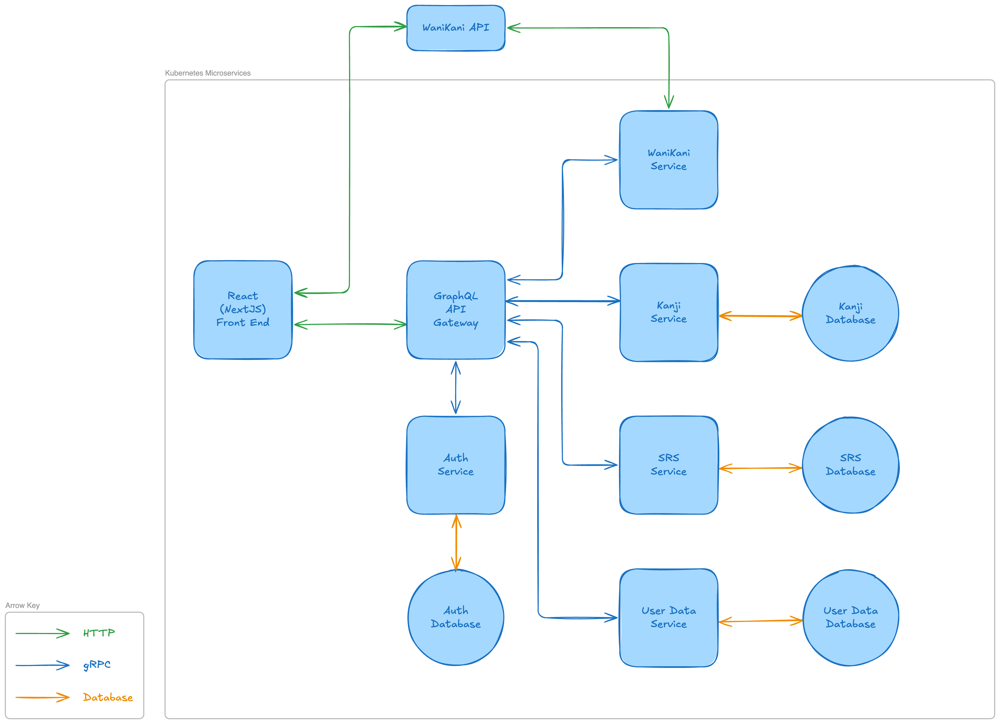

# kanikaki

---

## About
This is a project that I'm using to both learn different technology stacks and kanji. The goal of this application is to provide a kanji writing practice service that can also sync with the popular kanji learning service that uses a crab-aligator as its mascot, so that the user is able to practice writing the kanji that they have learned on that platform. As such, this project is named KaniKaki.

## Project Current Status

The project is currently at the state of infrastructure proof of concept. The application is able to communicate between multiple microservices. The currently implemented microservices have a a basic implementation that gives them basic functionality to their overall end goal.

The next stage is to flesh out the services and reach a functioning proof concept phase.

Other diagrams and documents may be found in the docs folder of this repository.

## Build

### Prereqs
| Dependency | Version |
| - | :-: |
| [Go](https://go.dev/) | 1.24.3 |
| [protoc](https://protobuf.dev/installation/) | 29.3 |
| [protoc-gen-go](https://grpc.io/docs/languages/go/quickstart/) | 1.5.1 |
| [protoc-gen-go-grpc](https://grpc.io/docs/languages/go/quickstart/) | 1.34.1 |
| [Node.js](https://nodejs.org/) | 22.13.0 |
| [Yarn](https://yarnpkg.com/getting-started/install) | 4.9.1 |

There are multiple ways to deploy this with the right terraform configuration. The one that is currently provides uses docker desktop as a way to conveniently develop on my desktop.

#### docker desktop quick setup instructions
1. Obtain the above prerequisites
2. Install make
3. Install docker desktop and enable kubernetes
4. Set up the following fonts (or set up alternatives):
    * Stroke order font:
      1. Obtain the font (https://www.nihilist.org.uk/)
      2. Place the font under `services\web\src\fonts\KanjiStrokeOrders` as `KanjiStrokeOrders.ttf`
    * Handwritten font:
      1. Obtain the font ([full version](https://booth.pm/ja/items/4186930) or [free trial](https://ilamemo.booth.pm/items/4186864))
      2. Place the font under `services\web\src\fonts\LeftHanded` as `LeftHanded.otf`
5. Run `make docker-k8s-ingress` (at some point I want to include the ingress into the terraform scripts so this extra step isn't needed)
6. Run `make redeploy`

The app should now be accessible on port 80.