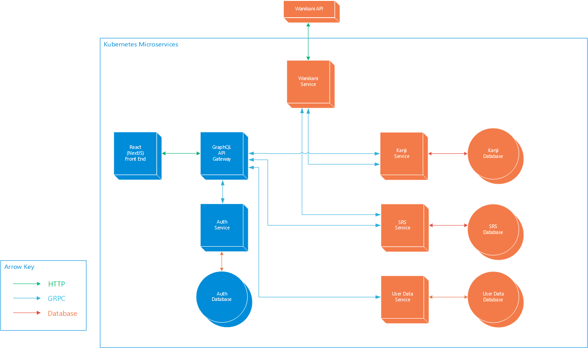

# kanikaki

---

## About
This is a project that I'm using to both learn different technology stacks and kanji. The goal of this application is to provide a kanji writing practice service that can also sync with the popular kanji learning service that uses a crab-aligator as its mascot, so that the user is able to practice writing the kanji that they have learned on that platform. As such, this project is named KaniKaki.

## Project Current Status

The project is currently at the state of infrastructure proof of concept. The application is able to communicate between multiple microservices and is able to provide a basic level of user authentication.

This is the current level of implementation (blue) amongst what is also planned (orange).

Other diagrams and documents may be found in the docs folder of this repository.

## Build

### Prereqs
| Dependency | Version |
| - | :-: |
| [Go](https://go.dev/) | 1.2.0 |
| [protoc](https://grpc.io/docs/protoc-installation/) | 3+ |
| [protoc-gen-go](https://grpc.io/docs/languages/go/quickstart/) | 1.2.8 |
| [protoc-gen-go-grpc](https://grpc.io/docs/languages/go/quickstart/) | 1.2 |
| [Node.js](https://nodejs.org/) | 20.0.0 |
| [Yarn](https://yarnpkg.com/getting-started/install) | 2+ |

There are multiple ways to deploy this with the right terraform configuration. The one that is currently provides uses docker desktop as a way to conveniently develop on my desktop.

#### docker desktop quick setup instructions
1. Obtain the above prerequisites
2. Install make
3. Install docker desktop and enable kubernetes
4. Run `make docker-k8s-ingress` (at some point I want to include the ingress into the terraform scripts so this extra step isn't needed)
5. Run `make redeploy`

The app should now be accessible on port 80.